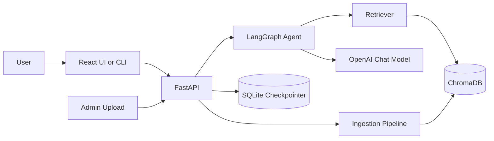
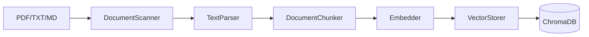
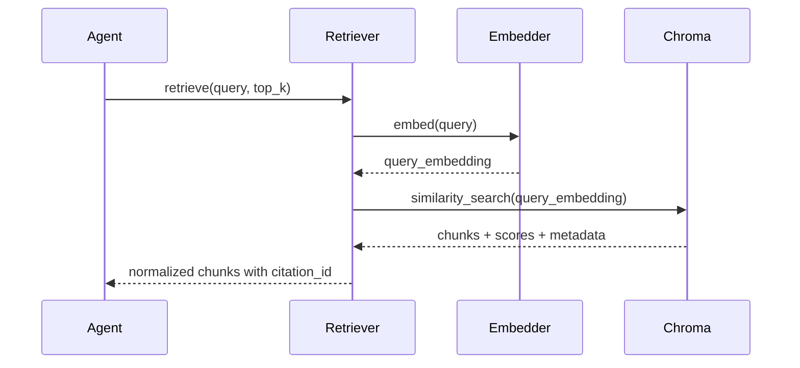
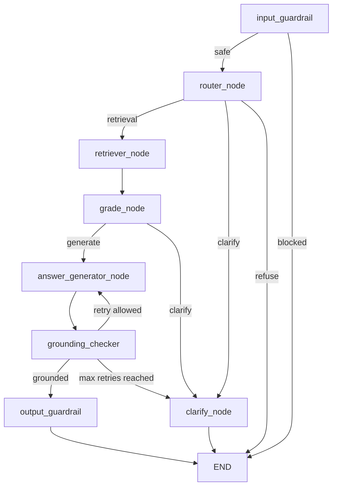
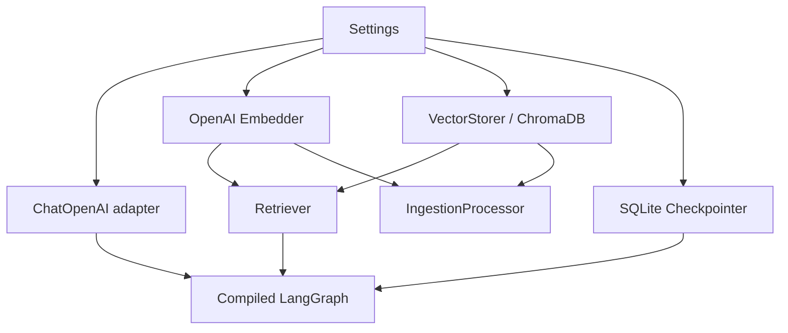

# Architecture

This document explains the technical architecture of the Tata Nexon Agentic RAG Chatbot. It is intended for maintainers, reviewers, and contributors who want to understand how ingestion, retrieval, agent orchestration, API delivery, and frontend interaction fit together.

## System Context

The application is a domain-specific assistant for Tata Nexon documents. It uses Retrieval-Augmented Generation to answer questions from ingested brochure and ownership content, while guardrails enforce a strict Tata Nexon-only scope.

At a high level:



## Major Subsystems

### 1. Configuration Layer

Location: `src/config/`

The configuration layer uses Pydantic Settings to load environment variables from `.env` and `.env.txt`.

Main files:

- `settings.py` - root `Settings`, app settings, memory settings
- `llm.py` - chat model, embedding model, API key, retry and timeout settings
- `retrieval.py` - ChromaDB collection, persistence directory, top-k, embedding dimension
- `ingestion.py` - chunk size and overlap defaults

Settings are immutable after loading. FastAPI builds long-lived runtime dependencies from these settings during application startup.

### 2. Ingestion Pipeline

Location: `src/ingestion/`

The ingestion pipeline converts source documents into searchable vector chunks.



Components:

- `scanner.py`
  - Loads PDF, TXT, and MD files
  - Uses PyMuPDF for PDF extraction
  - Returns standardized text and metadata

- `parsers/text_parser.py`
  - Cleans extracted text
  - Fixes common encoding artifacts
  - Removes simple page number noise
  - Extracts headings and sections

- `chunker.py`
  - Uses LangChain `RecursiveCharacterTextSplitter`
  - Preserves section metadata
  - Adds `source`, `section_title`, `chunk_index`, `total_chunks`, and `chunk_size`

- `embedder.py`
  - Uses OpenAI embeddings
  - Supports batch embedding
  - Handles missing API keys by returning empty embeddings with warnings

- `storer.py`
  - Uses ChromaDB persistent collections
  - Stores text, embeddings, metadata, and stable chunk IDs
  - Provides similarity search for retrieval

- `processor.py`
  - Orchestrates scanner, parser, chunker, embedder, and storer

Offline ingestion starts from `ingest.py`. API-driven ingestion uses `POST /admin/ingest`.

### 3. Retrieval Layer

Location: `src/retrieval/`

The retrieval layer embeds the user query and searches ChromaDB.



`Retriever` returns normalized chunks with:

- `text`
- `metadata`
- `score`
- `citation_id`

Citation IDs follow:

```text
{source}:{chunk_index}
```

### 4. LangGraph Agent

Location: `src/agent/`

The LangGraph agent is the reasoning and control layer. The graph is assembled in `src/agent/graph.py`.



#### Agent State

Location: `src/agent/state.py`

The graph state tracks:

- user messages and query
- route decisions
- retrieved and graded chunks
- generation output
- citations
- grounding and hallucination flags
- guardrail status
- retry counters
- errors

#### Structured Schemas

Location: `src/agent/schemas.py`

Important models:

- `QueryAnalysis`
- `ChunkGradeResult`
- `AgentResponse`
- `GroundingCheck`
- `GuardrailDecision`
- `InputGuardrailResult`
- `OutputGuardrailResult`
- `ClarificationResponse`

Critical LLM nodes use structured output with Pydantic models.

#### Node Responsibilities

| Node | Purpose |
| --- | --- |
| `input_guardrail` | First gate. Blocks unsafe, off-topic, prompt-injection, and external comparison queries. |
| `router_node` | Routes safe queries to retrieval or clarification. Also defensively handles comparison queries if called directly. |
| `retriever_node` | Calls the retrieval module and stores retrieved chunks/citations in state. |
| `grade_node` | Scores retrieved chunks for relevance and decides whether context is sufficient. |
| `answer_generator_node` | Generates a structured answer from graded context. |
| `grounding_checker` | Checks answer support against retrieved context and controls retry. |
| `output_guardrail` | Final safety, citation, and grounding gate before response leaves the graph. |
| `clarify_node` | Produces a polite clarification when the agent cannot answer safely or confidently. |

### 5. Guardrail Architecture

The input guardrail is the absolute entry point. If it blocks input, no router, retrieval, or generation node executes.

Blocked categories include:

- prompt injection
- harmful or illegal content
- abusive or NSFW content
- off-topic requests
- external car comparisons

Examples blocked as comparison requests:

```text
Compare Tata Nexon with Tata Sierra
Nexon vs Sierra performance
Is Nexon better than Kia Sonet?
Difference between Tata Nexon and Maruti Brezza
```

Examples allowed:

```text
Tell me about the warranty
What is the coverage?
Safety features of this vehicle
What is the performance of this car?
Compare Tata Nexon variants
```

The output guardrail runs after grounding. It prevents unsafe, unsupported, empty, or uncited factual answers from leaving the graph.

### 6. Memory and Sessions

Location: `src/agent/memory.py`

The system supports multi-turn conversations through LangGraph checkpointers.

Supported backends:

- `sqlite` using `SqliteSaver`
- `memory` using `MemorySaver`

Thread IDs are passed through LangGraph runtime config:

```python
{"configurable": {"thread_id": thread_id}}
```

The API and CLI can continue conversations by reusing the same `thread_id`.

### 7. FastAPI Layer

Location: `src/api/`

FastAPI acts as the delivery and dependency-wiring layer.

Main files:

- `main.py`
  - App factory
  - Lifespan setup
  - CORS
  - Health route
  - Safe JSON error handling

- `dependencies.py`
  - Builds runtime dependencies
  - Loads real LLM, embedder, vector store, retriever, graph, and ingestion processor

- `routes/chat.py`
  - `POST /chat`
  - `POST /chat?stream=true`
  - `GET /chat?message=...&stream=true`
  - Converts graph state into API responses

- `routes/admin.py`
  - `POST /admin/ingest`
  - `GET /admin/documents`
  - `GET /admin/stats`
  - Supports file upload, duplicate detection, force reprocess, and document metadata

### 8. Frontend Layer

Location: `frontend/`

The frontend is a React + Vite + TypeScript application styled with Tailwind CSS.

Key files:

- `src/App.tsx`
- `src/components/ChatWindow.tsx`
- `src/components/Message.tsx`
- `src/components/Sidebar.tsx`
- `src/components/AdminPanel.tsx`
- `src/hooks/useChat.ts`
- `src/lib/api.ts`

The chat UI supports streaming through Server-Sent Events and displays citations returned by the API.

## Runtime Dependency Wiring

The API lifespan builds dependencies once:



This avoids dummy components in production paths and keeps test overrides simple.

## Chat Request Lifecycle

1. Client sends a message to `/chat`.
2. API creates or reuses a `thread_id`.
3. API builds initial `AgentState`.
4. LangGraph starts at `input_guardrail`.
5. Safe Tata Nexon queries proceed to `router_node`.
6. Router sends answerable queries to retrieval.
7. Retrieved chunks are graded.
8. Answer generator creates a structured `AgentResponse`.
9. Grounding checker validates the answer.
10. Output guardrail performs final safety validation.
11. API normalizes state into `ChatResponse`.
12. Client renders answer, citations, confidence, and optional reasoning.

## Admin Ingestion Lifecycle

1. Admin uploads PDF/TXT/MD through `/admin/ingest`.
2. API saves the upload to `data/admin_uploads/`.
3. SHA-256 hash is calculated for duplicate detection.
4. Duplicate documents are skipped unless `force_reprocess=true`.
5. Ingestion processor loads, parses, chunks, embeds, and stores chunks.
6. ChromaDB receives chunks with rich metadata, including document hash.
7. API returns chunk counts and metadata.

## Data and Persistence

| Data | Default Location | Purpose |
| --- | --- | --- |
| ChromaDB vectors | `.chroma/` | Persistent vector index |
| Conversation memory | `chatbot_memory.db` | LangGraph checkpoint memory |
| Session registry | `chatbot_sessions.json` | CLI/session convenience |
| Source docs | `data/ingestion_docs/` | Offline ingestion input |
| Admin uploads | `data/admin_uploads/` | Uploaded documents |

## Testing Strategy

The project follows test-first development for major components.

Test areas:

- `tests/ingestion/` - scanner, parser, chunker, embedder, storer, processor
- `tests/retrieval/` - retriever unit and functional behavior
- `tests/agent/` - graph compilation, memory, and individual nodes
- `tests/api/` - FastAPI routes and response behavior
- `tests/config/` - settings loading and validation

Run:

```bash
python -m pytest tests/ -q
```

## Design Principles

- Keep each layer independently testable.
- Keep ingestion, retrieval, agent reasoning, API, and UI concerns separate.
- Use structured outputs for LLM decisions.
- Make guardrails explicit and auditable.
- Prefer dependency injection over hidden globals.
- Keep local development simple with ChromaDB and SQLite.
- Preserve citations from retrieval through final response.

## Extension Points

Possible future improvements:

- Add authentication for admin endpoints.
- Add persistent document registry instead of process-local summaries.
- Add background ingestion jobs for large uploads.
- Add richer citation rendering with page-level links.
- Add observability with tracing and metrics.
- Add deployment configuration for Docker or cloud hosting.
- Add additional vehicle documents only if scope rules are intentionally changed.
